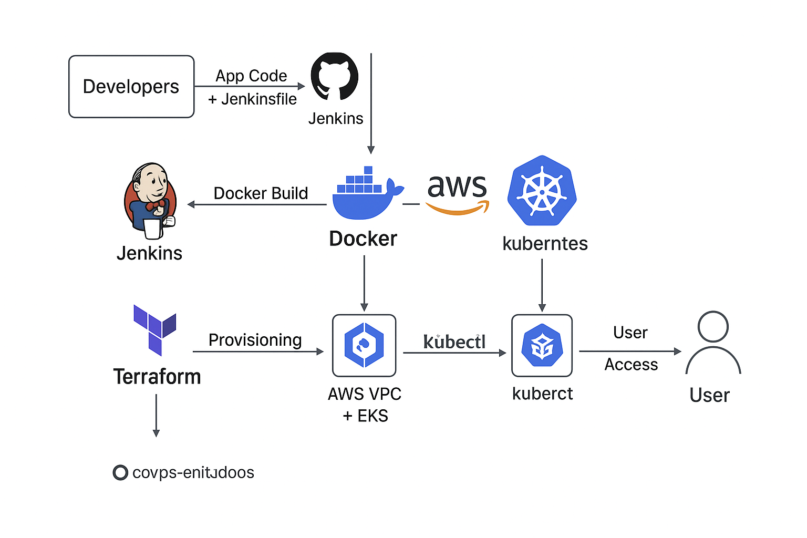

# DevOps CI/CD Project on AWS with Docker & Kubernetes



## 🚀 Project Overview

This project demonstrates a complete **DevOps CI/CD pipeline** for a Node.js application using **Docker, Kubernetes, Jenkins, and AWS**. The infrastructure is provisioned with **Terraform**, and the application is deployed on an **EKS cluster**, with automated updates triggered through a **Jenkins pipeline**.

Users can access the application via a LoadBalancer service and optionally configure **Ingress** with TLS using **cert-manager**.

---

## 🔧 Tech Stack

* **Infrastructure:** Terraform, AWS (VPC, Subnets, EKS)
* **CI/CD:** Jenkins Pipeline
* **Containerization:** Docker, Docker Hub
* **Orchestration:** Kubernetes (Deployment, Service, Ingress)
* **Application:** Node.js, Express

---

## 📂 Repository Structure

```
github/
├── README.md
├── architecture-diagram.png
├── app/
│   ├── Dockerfile
│   ├── index.js
│   └── package.json
├── jenkins/
│   ├── Jenkinsfile
│   └── plugins.txt
├── k8s/
│   ├── deployment.yaml
│   ├── service.yaml
│   └── ingress.yaml
└── terraform/
    ├── main.tf
    ├── vpc.tf
    ├── eks.tf
    ├── outputs.tf
    └── variables.tf
```

---

## ▶️ Getting Started

### 1️⃣ Provision AWS Infrastructure

Use **Terraform** to create the VPC, subnets, and EKS cluster.

```bash
cd terraform
terraform init
terraform plan
terraform apply -auto-approve
```

> Outputs will include the **EKS cluster name, endpoint, and CA certificate**.
> Make sure you configure `kubectl` to use this cluster:

```bash
aws eks --region ap-south-1 update-kubeconfig --name devops-project-eks
```

---

### 2️⃣ Jenkins Pipeline Setup

1. Install Jenkins on a server or use an existing instance.
2. Install required plugins from `jenkins/plugins.txt`.
3. Create a new pipeline job and point it to the Jenkinsfile in this repo.
4. Update the Jenkinsfile:

   * **Git repository URL:** `https://github.com/YOUR_GITHUB_USERNAME/devops-ci-cd-aws-k8s.git`
   * **Docker Hub image:** `pruthvirajpha/devops-app` (or your own)
5. Run the pipeline to automatically deploy the app to Kubernetes.

---

### 3️⃣ Kubernetes Deployment

1. Apply the Kubernetes manifests:

```bash
kubectl apply -f k8s/deployment.yaml
kubectl apply -f k8s/service.yaml
kubectl apply -f k8s/ingress.yaml
```

2. Verify the pods, service, and ingress:

```bash
kubectl get pods
kubectl get svc
kubectl get ingress
```

3. Access the application:

   * **LoadBalancer:** `kubectl get svc devops-service` → EXTERNAL-IP
   * **Ingress:** `https://meera.shop` (if domain configured)

---

## ⚡ Features

* Fully automated CI/CD pipeline with Jenkins
* Node.js application containerized with Docker
* Kubernetes deployment with LoadBalancer service
* Optional TLS-enabled Ingress using cert-manager
* AWS infrastructure provisioned with Terraform (VPC + EKS + Node Groups)

---

## 📌 Notes

* Replace domain in `k8s/ingress.yaml` with your own domain.
* Ensure Docker Hub image exists and is publicly accessible.
* Jenkins server must have `kubectl` access to the EKS cluster.

---

## 🖼 Architecture Diagram


> Shows the interaction between **Jenkins, Docker, EKS nodes, and the deployed Node.js application**.
