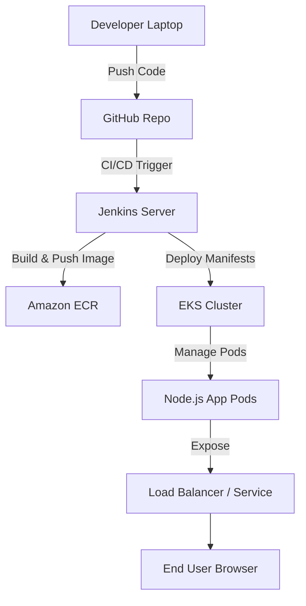

# 🚀 Node.js DevOps Project with Docker, Kubernetes, Terraform, Jenkins & AWS EKS  

  
  
  
  
  
  

---

## 📌 Overview
This project demonstrates a **Node.js application** deployed using **Docker**, **Kubernetes (Minikube/EKS)**, and automated via **Terraform** and **Jenkins CI/CD**.  
It covers the **end-to-end DevOps lifecycle**:  

- **Local development** with Docker/K8s  
- **Infrastructure provisioning** with Terraform  
- **Universal IAM Role** for AWS resources (EC2, VPC, EKS)  
- **CI/CD pipeline** with Jenkins for automated deployments  

---

## 📐 Architecture  



---

## ⚡ Quick Start

```bash
# Clone the repo
git clone https://github.com/PruthvirajPhadatare/Node-js-DevOps-Project.git
cd Node-js-DevOps-Project
```

Choose your path:  
- 🐳 [Run Locally with Docker](#-local-deployment-using-docker)  
- ☸️ [Deploy with Kubernetes](#-kubernetes-deployment-local-minikube)  
- ☁️ [Deploy on AWS EKS](#-aws-eks-deployment)  
- 🔄 [Automate with Jenkins CI/CD](#-jenkins-pipeline-setup)  

---

## 🐳 Local Deployment using Docker

```bash
# Build Docker image
docker build -t nodejs-devops-app .

# Run container
docker run -d -p 3000:3000 nodejs-devops-app
```

App will be available at 👉 `http://localhost:3000`  

---

## ☸️ Kubernetes Deployment (Local Minikube)

```bash
# Start Minikube
minikube start

# Deploy application
kubectl apply -f k8s/

# Check pods & services
kubectl get pods
kubectl get svc
```

---

## ☁️ AWS EKS Deployment

### 1️⃣ Provision Infrastructure with Terraform  
`infra/main.tf` (Universal IAM Role + VPC + EKS + NodeGroup)

```bash
cd infra/
terraform init
terraform apply -auto-approve
```

### 2️⃣ Update kubeconfig  
```bash
aws eks --region ap-south-1 update-kubeconfig --name my-eks-cluster
```

### 3️⃣ Deploy App to EKS  
```bash
kubectl apply -f k8s/
kubectl get pods
kubectl get svc
```

---

## 🔑 Universal IAM Role  

Terraform automatically provisions a **universal IAM role** with:  

- Full access to **EKS, EC2, VPC**  
- Attached to **Jenkins EC2** for deployments  

---

## 🔄 Jenkins Pipeline Setup  

### 1️⃣ Launch Jenkins Server (Ubuntu EC2)  

Install required tools:  
```bash
# Update system
sudo apt update -y

# Install Java 17
sudo apt install -y openjdk-17-jdk

# Install Git
sudo apt install -y git

# Install Docker
sudo apt install -y docker.io
sudo usermod -aG docker jenkins

# Install AWS CLI
sudo apt install -y awscli

# Install kubectl
curl -LO "https://dl.k8s.io/release/$(curl -s https://dl.k8s.io/release/stable.txt)/bin/linux/amd64/kubectl"
chmod +x kubectl && sudo mv kubectl /usr/local/bin/

# Install Jenkins
sudo apt install -y jenkins
```

---

### 2️⃣ Configure Jenkins Plugins  
- **Git Plugin**  
- **Pipeline Plugin**  
- **Kubernetes CLI Plugin**  
- **AWS Credentials Plugin**  

---

### 3️⃣ Add AWS & Git Credentials in Jenkins  

- Go to **Manage Jenkins → Credentials → Add Credentials**  
- Add:  
  - **AWS Access Key & Secret**  
  - **GitHub PAT (if private repo)**  

---

### 4️⃣ Configure Jenkins Pipeline  

- Job Type: **Pipeline**  
- Git Repo: `https://github.com/PruthvirajPhadatare/Node-js-DevOps-Project.git`  
- Jenkinsfile Path: `jenkins/Jenkinsfile`  

Pipeline will:  
1. Pull latest code  
2. Build Docker image  
3. Push to ECR  
4. Deploy to EKS  

---

## ✅ Tech Stack  

| Tool        | Purpose |
|-------------|---------|
| **Node.js** | Backend Application |
| **Docker**  | Containerization |
| **Kubernetes** | Orchestration |
| **Terraform** | Infrastructure as Code |
| **AWS EKS** | Managed Kubernetes |
| **Jenkins** | CI/CD Pipeline |

---

## 👨‍💻 Author  

**Pruthviraj Phadatare**  
- 📧 Email: pruthvirajphadatare@outlook.com  
- 🌐 [GitHub](https://github.com/PruthvirajPhadatare)  

---
